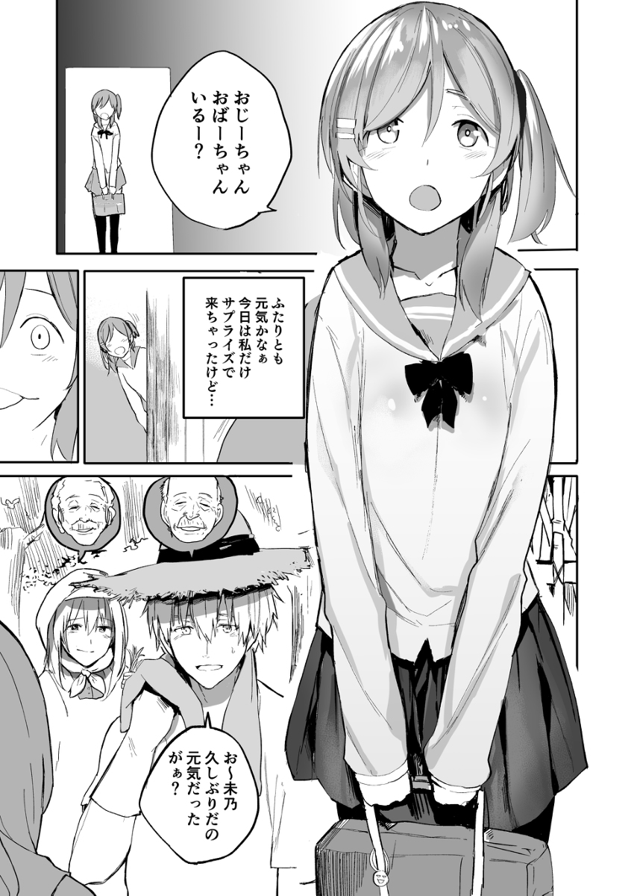
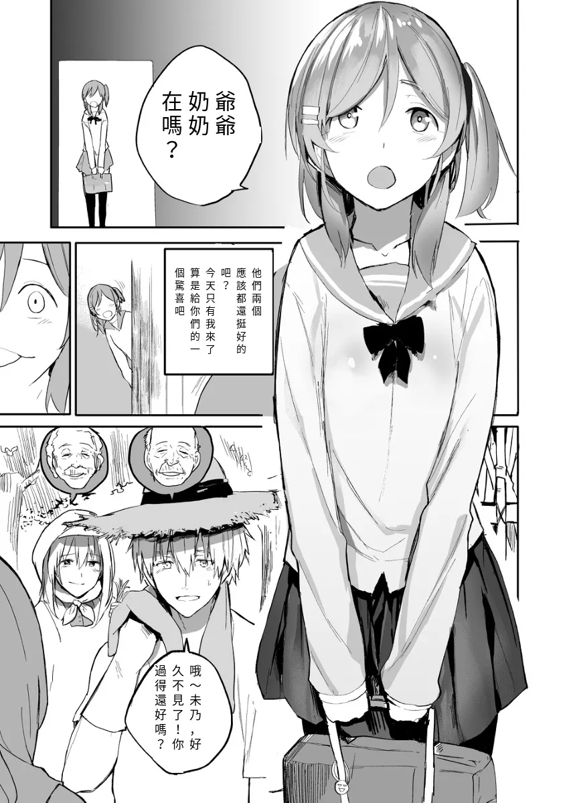
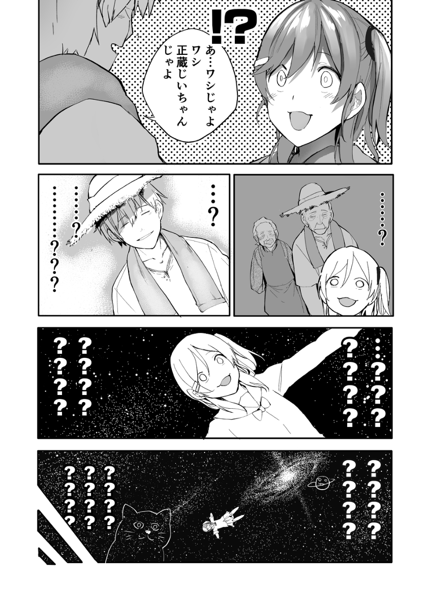
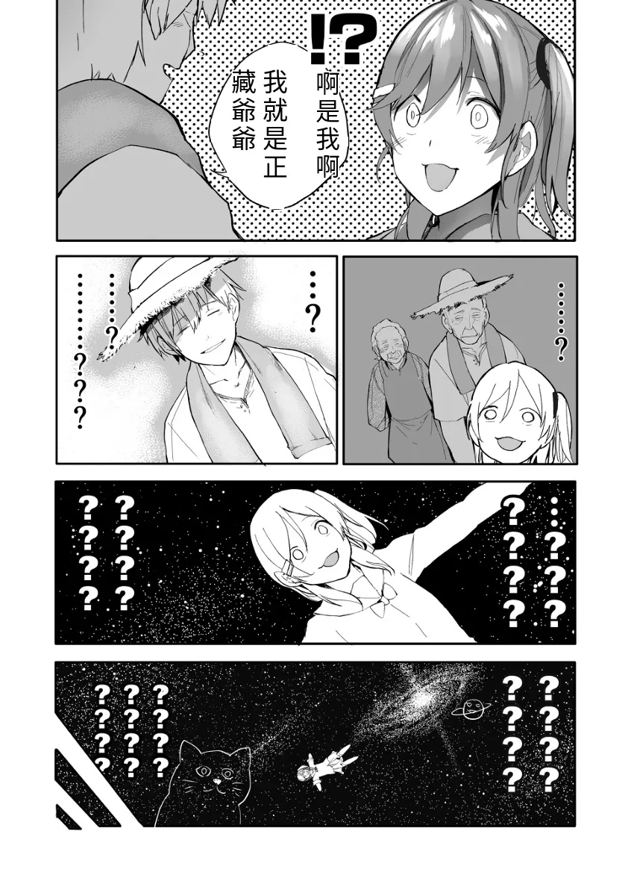
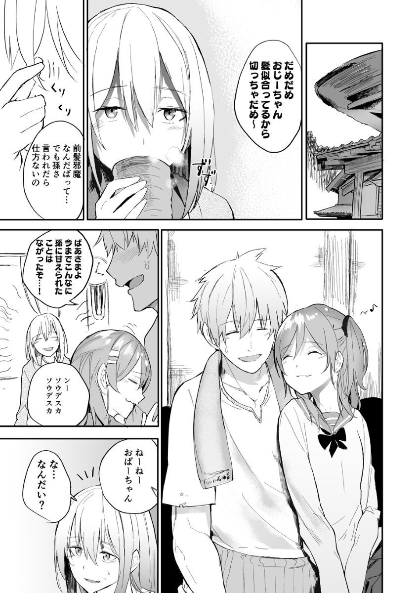
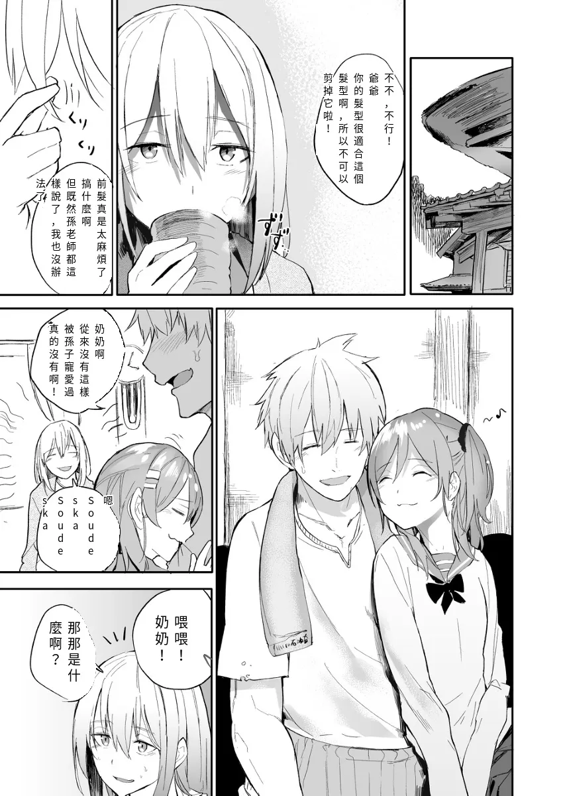
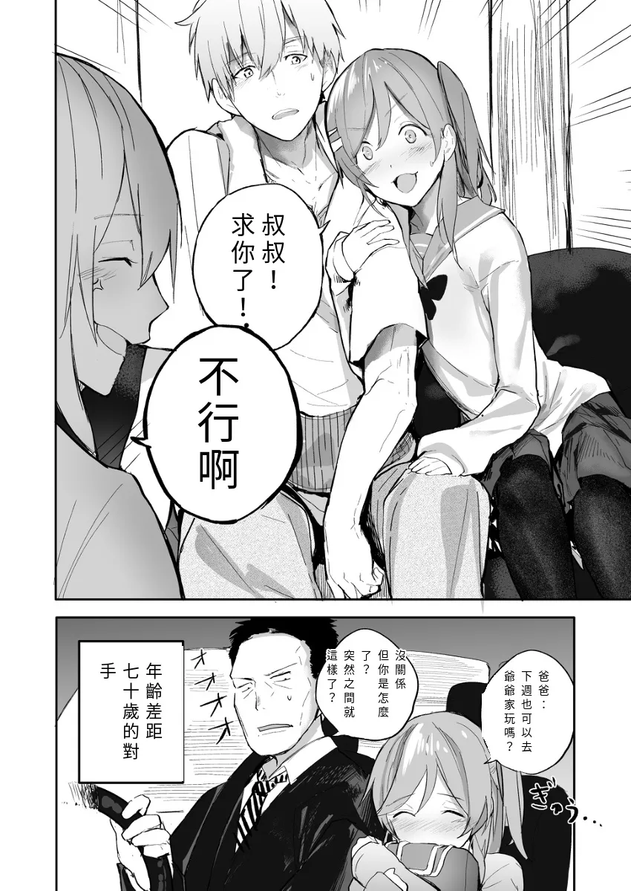

# ComicTrans-TW

An automated pipeline for translating Japanese manga to Traditional Chinese using state-of-the-art computer vision and NLP models.

## Results

### Translation Examples

| Source  | Translated  |
|:------------:|:-------------------:|
|  |  |
|  |  |
|  |  |
|  |  |


## System Architecture

The pipeline consists of 6 major stages:

```
┌─────────────┐
│   Image     │
│   Input     │
└──────┬──────┘
       │
       ├──────────────────────────────────────────────────────────┐
       │                                                          │
       ▼                                                          ▼
┌─────────────────────┐                              ┌──────────────────────┐
│  Text Mask          │                              │  Text Detection      │
│  Detection          │                              │  (PPOCRv5)           │
│  (YOLO-MANGA-FT)    │                              │                      │
└──────┬──────────────┘                              └──────┬───────────────┘
       │                                                     │
       │ text_mask.json                                      │ text_region.json
       │ (speech bubble masks)                               │ (fine-grained bboxes)
       │                                                     │
       ▼                                                     │
┌─────────────────────┐                                      │
│  OCR Recognition    │                                      │
│  (PaddleOCR-VL)     │                                      │
└──────┬──────────────┘                                      │
       │                                                     │
       │ ocr.json                                            │
       │ (Japanese text per bubble)                          │
       │                                                     │
       ▼                                                     │
┌─────────────────────┐                                      │
│  Translation        │                                      │
│  (Hunyuan MT)       │                                      │
└──────┬──────────────┘                                      │
       │                                                     │
       │ translation.json                                    │
       │ (Traditional Chinese)                               │
       │                                                     │
       ▼                                                     │
┌─────────────────────┐◄────────────────────────────────────┘
│  Text Allocater     │
│  (Region Refinement)│
└──────┬──────────────┘
       │
       │ text_allocate.json
       │ (allocated text per region)
       │
       ▼
┌─────────────────────┐
│  Render             │
│  (Inpainting +      │
│   Text Overlay)     │
└──────┬──────────────┘
       │
       ▼
┌─────────────┐
│  Translated │
│   Result    │
└─────────────┘
```

## Models Used

| Stage | Model | Purpose |
|-------|-------|---------|
| **Text Mask Detection** | YOLO-MANGA (Fine-tuned) | Segment speech bubbles and text regions |
| **Text Detection** | PP-OCRv5 (Fine-tuned on comics) | Detect precise text bounding boxes within bubbles |
| **OCR Recognition** | PaddleOCR-VL-Manga | Recognize Japanese text using vision-language model |
| **Translation** | Hunyuan MT 1.5-7B | Translate Japanese to Traditional Chinese |
| **Inpainting** | Pixel-based inpainting | Remove original text from bubbles |

## Quick Start

### Environment Setup

```bash
source venv_manager/ocr/bin/activate
pip install -r requirements.txt
```

### Simple API Usage

```python
from PIL import Image
from core.manga_translator import MangaTranslator

# Initialize translator (models are lazy-loaded)
translator = MangaTranslator(config_path="configs/pipeline.yml")

# Translate a single image
image = Image.open("input.jpg")
output_image, results = translator.translate_image(image)

# Save result
output_image.save("output.jpg")
```

### UI Usage

```bash
python ui/translate_entry.py
```

## Project Structure

```
japcomic2twcomic/
├── core/                         # Core pipeline logic
│   └── manga_translator.py       # Main translation pipeline
├── lib/                          # Library modules
│   ├── text_mask/                # YOLO segmentation
│   ├── text_detection/           # PPOCRv5 detection
│   ├── ocr/                      # OCR recognition
│   ├── translation/              # Translation models
│   ├── text_allocater/           # Text allocation
│   └── render/                   # Rendering
├── ui/                           # User interfaces
│   ├── translate_entry.py        # Main translation UI
│   └── dataset_annotator.py      # Annotation tool
├── configs/                      # Configuration files
│   └── pipeline.yml              # Pipeline configuration
├── data/                         # Input data
├── results/                      # Output results
└── PaddleOCR/                    # PaddleOCR repository
```

## Pipeline Stages (CLI)

### 1. Text Mask Detection

Segment speech bubbles using YOLO.

```bash
python -m lib.text_mask.yolo \
    --input_dir data/2 \
    --output_dir results/text_mask/2
```

**Output:** `text_mask.json` with speech bubble masks

### 2. Text Detection

Detect fine-grained text bounding boxes using fine-tuned PP-OCRv5.

```bash
python -m lib.text_detection.ppocrv5 \
    --text-det-model-dir PaddleOCR/output/inference/PP-OCRv5_comic_det_infer/ \
    --input-dir data/2/ \
    --output-dir results/text_detection/2/
```

**Output:** `text_region.json` with text bounding boxes

### 3. OCR Recognition

Recognize Japanese text using PaddleOCR-VL.

```bash
python -m lib.ocr.paddleocr_vl_manga \
    --layout-json results/text_mask/2/text_mask.json \
    --output-dir results/ocr/2
```

**Output:** `ocr.json` with recognized Japanese text

### 4. Translation

Translate to Traditional Chinese using Hunyuan MT.

```bash
python -m lib.translation.hunyuan \
    --input_path results/ocr/2/ocr.json \
    --output_path results/translation/2/hunyuan.json
```

**Output:** `hunyuan.json` with Traditional Chinese translations

### 5. Text Region Refinement

Allocate translated text to refined regions (combines segmentation + detection results).

```bash
python -m lib.text_allocater.text_allocater \
    --translation-json results/translation/2/hunyuan.json \
    --text-region-json results/text_detection/2/text_region.json \
    --output results/text_allocate/2/text_allocate.json \
    --split-strategy region_newline
```

**Output:** `text_allocate.json` with allocated text per region

### 6. Render

Render translated text onto original image with inpainting.

```bash
python -m lib.render.text_det_render \
    --text_mask results/text_mask/2/text_mask.json \
    --allocated_text results/text_allocate/2/text_allocate.json \
    --output results/render/2/
```

**Output:** Translated manga images

### 7. Visualization (Optional)

Visualize bounding boxes for debugging.

```bash
# Visualize allocated text regions
python -m lib.utils.draw_bbox_on_render \
    --render_dir results/render/ \
    --text_allocate results/text_allocate/text_allocate.json \
    --output results/render/render_with_bbox/

# Visualize translation bounding boxes
python -m lib.utils.draw_translated_text_bbox_on_image \
    --translation results/translation/hunyuan.json \
    --output results/translation/translation_bbox/
```

## Fine-tuning PaddleOCR Engine

### Fine-tune Detection Module

```bash
# 0. Setup environment
git clone https://github.com/PaddlePaddle/PaddleOCR
cd PaddleOCR

# 1. Prepare dataset
python ui/dataset_annotator.py
python core/prep_benchmark/prep_det_benchmark.py --input data/comic_benchmark/det/annotations.txt --output_dir data/comic_benchmark/det
cp -r data/comic_benchmark/det PaddleOCR/comic_benchmark

# 2. Download the PP-OCRv5_server_det pre-trained model
wget https://paddle-model-ecology.bj.bcebos.com/paddlex/official_pretrained_model/PP-OCRv5_server_det_pretrained.pdparams

# 3. Model fine-tune
python3 tools/train.py -c configs/det/PP-OCRv5/PP-OCRv5_comic_det.yml \
    -o Global.pretrained_model=./PP-OCRv5_server_det_pretrained.pdparams \
    Train.dataset.data_dir=./comic_benchmark/det \
    Train.dataset.label_file_list='[./comic_benchmark/det/train.txt]' \
    Eval.dataset.data_dir=./comic_benchmark/det \
    Eval.dataset.label_file_list='[./comic_benchmark/det/val.txt]'

# 4. Model export
python3 tools/export_model.py -c configs/det/PP-OCRv5/PP-OCRv5_comic_det.yml -o \
    Global.pretrained_model=output/PP-OCRv5_comic_det/latest.pdparams \
    Global.save_inference_dir="output/inference/PP-OCRv5_comic_det_infer/"
```

## Evaluation

### OCR Evaluation

Prepare OCR ground truth:

```bash
# 1. Get annotations
python ui/dataset_annotator.py

# 2. Convert to corresponding format
python3 core/prep_benchmark/ocr_gt_converter.py  \
    --input data/comic_benchmark/det/annotations.txt \
    --output data/benchmark/ocr_groundtruth
```

Run evaluation:

```bash
# Metrics: CER (Character Error Rate), mIoU, precision
python core/eval/eval_ocr_gt.py \
    --pred-file results/2/ocr.json \
    --gt-dir data/benchmark/ocr_groundtruth
```

### Translation Evaluation

```bash
# Prepare ground truth
python ui/translation_gt_annotater.py

# Evaluate translation
# Metrics: CER (Character Error Rate)
python core/eval/eval_translation_gt.py \
    -p results/2/translated.json \
    -g data/benchmark/translation_groundtruth
```


## Acknowledgments

- [PaddleOCR](https://github.com/PaddlePaddle/PaddleOCR) for OCR models
- [Hunyuan MT](https://github.com/Tencent/HunyuanMT) for translation model
- [YOLO](https://github.com/ultralytics/ultralytics) for segmentation
